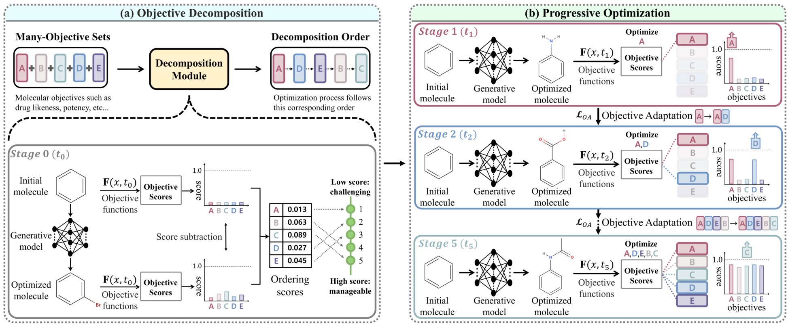

# DyMol (Dynamic Many-Objective Molecular Optimization: Unfolding Complexity with Objective Decomposition and Progressive Optimization)
Official implementation of "Dynamic Many-Objective Molecular Optimization: Unfolding Complexity with Objective Decomposition and Progressive Optimization"



**TL;DR:** We propose a novel method for tackling dynamic many-objective molecular optimization problem by utilizing objective decomposition and progressive optimization. 

(a) **Objective Decomposition:** our method decomposes complex many-objective sets into more manageable sub-problems facilitated by our decomposition module, which analyzes the complexities of each objective and automatically determines the order.

(b) **Progressive Optimization:** The optimization process begins with a single objective and, as time progresses, systematically incorporates each subsequent objective according to the decomposition order.


## Paper:
For full paper (including the supplementary material), please [click here](./DyMol_FullPaper.pdf).

For the supplementary material only, please [click here](./DyMol_Supplementary.pdf).


## Experiments:
Note that our code is heavily dependent on and built from the PMO benchmark code, which can be found [here](https://github.com/wenhao-gao/mol_opt).

You can simply run the DyMol code by using the following command:
```bash
python run.py reinvent_cl --oracles qed:1+sa:1+jnk3:1+gsk3b:1 --seed=1
```

## Colab Notebook:

The Colab notebook for this project can be found here: [Open in Colab](https://colab.research.google.com/drive/1iiDNJDSDEqcjRJNT402hz5B3I_boN3Mw#scrollTo=9tnOBuBOprD6)

### Important Note

As of May 17, 2024, the notebook `DyMol Colab Notebook.ipynb` has been tested and is working correctly. However, please be aware that changes in library versions or updates to the Colab environment may affect its functionality in the future.

